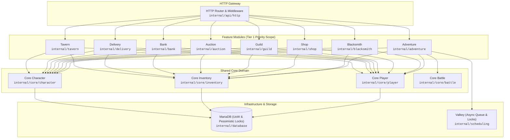

# Architecture Guidance Layer & Repository Intelligence (.arch/)

## 1. Executive Summary

The **Guidance Layer** (`.arch/`) provides an AI-friendly, token-efficient semantic navigation index into the Party2Re codebase. It bridges high-level architectural understanding and low-level source code verification while strictly maintaining **Source Code & Comments as the absolute Ground Truth**.

```text
+-------------------------------------------------------------+
|                 Guidance Layer (.arch/)                     |
|  - modules/*.json (Granular Lock & Transaction Coordinates) |
+-------------------------------------------------------------+
                              |
                     source_ref (path#Symbol)
                              v
+-------------------------------------------------------------+
|                 Ground Truth (Production Go Code)           |
|  - Consumer interfaces, RunInTx methods, Go docstrings      |
+-------------------------------------------------------------+
```

---

## 2. System Architecture Topology

The high-level component topology and layer boundaries of Party2Re are visually documented below via native Mermaid:



---

## 3. Module Selection Criteria

To prevent documentation rot and keep maintenance overhead negligible, detailed module definitions (`.arch/modules/<module>.json`) are **not** created for every Go package. Instead, modules are evaluated against four objective criteria:

| Axis | Condition | Leverage |
| :--- | :--- | :--- |
| **C1: Transaction Depth** | Spans 2+ distinct entity/table mutations within a single `RunInTx` boundary. | **Required** |
| **C2: Lock Hierarchy** | Implements deterministic `SELECT ... FOR UPDATE` pessimistic locking (e.g., ascending ID sorting or multi-table order). | **High** |
| **C3: Shared / Escrow State** | Handles multi-player transactions, escrow balances, player-to-player transfers, or guild states. | **High** |
| **C4: Async Scheduling** | Integrates with Valkey delayed job queues and background execution workers. | **Medium** |

---

## 4. Target Tier Inventory

Based on the selection criteria above, all packages in `internal/` are triaged into three distinct tiers:

### Tier 1: High-Leverage Priority Targets (Core Guidance Scope)
*Modules meeting at least 2 criteria (C1, C2, C3). These represent the primary deadlock and concurrency race risks in Party2Re.*

| Module | Package Path | Primary Transaction Flows | Lock Hierarchy Order | Guidance Definition |
| :--- | :--- | :--- | :--- | :--- |
| **Tavern** | `internal/tavern` | `OrderMeal`, `ClaimDelivery` | `characters(2) -> tavern_character_status(8)` | [tavern.json](file:///home/witchcraze/dev/party2re/.arch/modules/tavern.json) |
| **Delivery** | `internal/delivery` | `AcceptQuest`, `CompleteDelivery`, `SendParcel`, `ClaimParcel` | `characters(2) -> inventory_items(3) -> delivery_parcels(8)` | [delivery.json](file:///home/witchcraze/dev/party2re/.arch/modules/delivery.json) |
| **Bank** | `internal/bank` | `Deposit`, `Withdraw`, `Transfer` | `characters(2) -> bank_accounts(6, p1<p2) -> bank_transfers(8)` | [bank.json](file:///home/witchcraze/dev/party2re/.arch/modules/bank.json) |
| **Auction** | `internal/auction` | `CreateListing`, `PlaceBid`, `Buyout`, `CancelListing` | `auction_listings(8) -> characters(2, bidder) -> characters(2, refund)` | [auction.json](file:///home/witchcraze/dev/party2re/.arch/modules/auction.json) |
| **Guild** | `internal/guild` | `CreateGuild`, `Donate` | `characters(2) -> guilds(7) -> guild_members(7)` | [guild.json](file:///home/witchcraze/dev/party2re/.arch/modules/guild.json) |
| **Shop** | `internal/shop` | `Purchase`, `Sell` | `characters(2) -> inventory_items(3)` | [shop.json](file:///home/witchcraze/dev/party2re/.arch/modules/shop.json) |
| **Blacksmith** | `internal/blacksmith` | `Enhance` | `characters(2) -> inventory_items(3)` | [blacksmith.json](file:///home/witchcraze/dev/party2re/.arch/modules/blacksmith.json) |
| **Adventure** | `internal/adventure` | `StartStage`, `Complete` (Worker) | `characters(2) -> adventures(8) -> inventory_items(3)` | [adventure.json](file:///home/witchcraze/dev/party2re/.arch/modules/adventure.json) |

### Tier 2: On-Demand Targets (Secondary Scope)
*Modules with moderate complexity or single-resource mutations. Guidance files are authored on-demand only when substantial refactoring or cross-feature coupling occurs.*
- `alchemy`, `dungeon`, `casino`, `medal`, `depot`, `activity`, `farm`, `park`, `home`, `collection`, `chapel`, `secretshop`, `blackmarket`, `eventplaza`, `pvp`, `gvg`, `boss`, `rescue`.

### Tier 3: Out-of-Scope (Excluded from Module-Level JSON)
*Stateless utilities, infrastructure adapters, and self-contained domain entities where Go interfaces and docstrings provide 100% sufficient clarity.*
- **Utilities**: `id`, `pagination`, `validation`, `logging`, `ratelimit`, `valkey`, `architecture`
- **Core Entities**: `core/player`, `core/character`, `core/job`, `core/item`, `core/skill`, `core/progression`, `core/battle`.

---

## 5. Reverse Fan-in Shared Table Index (.arch/shared_tables/)

To assess the blast radius of modifying core database tables and verify global deadlock hierarchies across multiple feature callers without full-codebase grep scans, the Guidance Layer provides a **Reverse Fan-in Index**:

```text
DB Table (e.g. characters)
   │
   ├── Repository Implementation: internal/database/character_repository.go#CharacterRepository
   ├── Consumer Interfaces: [Shop, Blacksmith, Tavern, Delivery, Adventure]
   └── Callers:
         ├─ [Shop] Purchase / Sell (Lock order: 2, SELECT ... FOR UPDATE)
         ├─ [Bank] Deposit / Withdraw (Lock order: 2, UPDATE)
         ├─ [Blacksmith] Enhance (Lock order: 2, SELECT ... FOR UPDATE)
         ├─ [Auction] PlaceBid / Buyout (Lock order: 2, UPDATE)
         ├─ [Guild] CreateGuild / Donate (Lock order: 2, UPDATE)
         ├─ [Tavern] OrderMeal / ClaimDelivery (Lock order: 2, SELECT ... FOR UPDATE)
         ├─ [Delivery] CompleteDelivery / SendParcel / ClaimParcel / CancelParcel (Lock order: 2)
         └─ [Adventure] StartStage (SELECT) / Claim (UPDATE)
```

### Shared Table Index Inventory
- [characters.json](file:///home/witchcraze/dev/party2re/.arch/shared_tables/characters.json) (Tier 2, High Fan-in Character wallet, stats, progression)
- [inventory_items.json](file:///home/witchcraze/dev/party2re/.arch/shared_tables/inventory_items.json) (Tier 3, Character item instance repository)
- [bank_accounts.json](file:///home/witchcraze/dev/party2re/.arch/shared_tables/bank_accounts.json) (Tier 6, Player savings accounts)
- [guilds.json](file:///home/witchcraze/dev/party2re/.arch/shared_tables/guilds.json) (Tier 7, Guild organization records)

---

## 6. Automated Mechanical Verification (Zero-Token Overhead)

All `.arch` definitions (both module definitions and shared table reverse indices) are continuously protected against syntax errors, symbol renaming, and doc rot via Go AST testing:

1. **Go AST Symbol & Transaction Linter** (`internal/architecture/arch_test.go`):
   - Parses all `.arch/modules/*.json` and `.arch/shared_tables/*.json` files in **~0.05s** during standard `go test ./...` and `scripts/verify.sh` step `[4/7]`.
   - Verifies that every interface name, struct method, consumer interface, caller method, and exported type linked via `source_ref` (`path#Symbol`) strictly exists in the Go source code.
   - Verifies that all symbols declared with `transaction_type: "RunInTx"` or `tx_mode: "RunInTx"` physically contain `RunInTx` invocations in their AST function bodies.
   - Requires zero external runtimes (pure Go standard library `go/parser` and `go/ast`).

---

## 7. Continuous Governance & Evolution Process (Issue-Driven Architecture)

The Guidance Layer is designed as a living, evolvable system rather than a static artifact. New tiers, module re-classifications, and artifact types can be proposed and adopted through the standard GitHub Issue workflow:

### A. Tier Promotion & Demotion Process
- **When to Promote (Tier 2/3 -> Tier 1)**: When an existing module is refactored to introduce multi-resource transactions (`RunInTx`), deterministic row-locking hierarchies, or multi-player escrow state.
- **When to Demote (Tier 1 -> Tier 2/3)**: When a feature is simplified, decoupled, or deprecated.
- **Procedure**: Submit an Architecture Issue (`.github/ISSUE_TEMPLATE/architecture.md`) describing the transaction changes and requesting module definition creation/archival.

### B. Introducing New Artifact Types & Schemas
- Future Guidance extensions (e.g. `workers/*.json` for delayed job state machines) follow the same RFC process:
  1. Define schema and invariants.
  2. Extend AST / validator checks in `internal/architecture/arch_test.go`.
  3. Submit via an Architecture PR.
