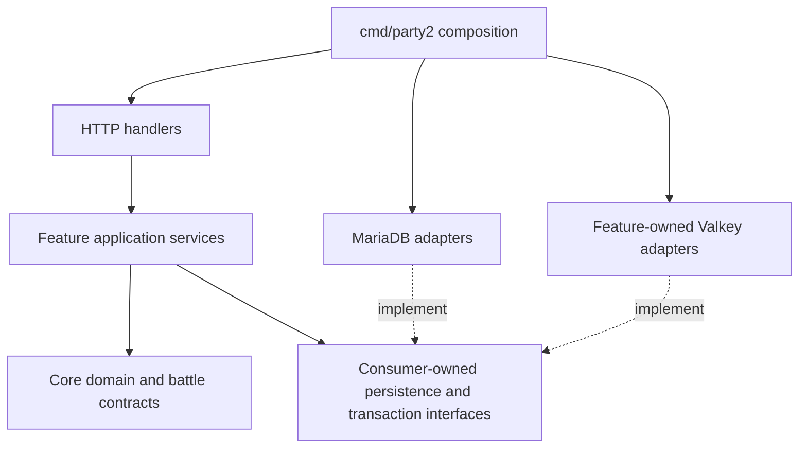

# Architecture Guidance Layer (.arch/)

`.arch/` is a navigation index for transaction boundaries, dependencies, and
shared-table callers. Source references identify the current Go implementation;
the original Party2 remains authoritative for game behavior. Neither this index
nor a passing AST test certifies legacy parity.

## Dependency topology

```mermaid
flowchart TB
    HTTP[HTTP handlers] --> Features[Feature application services]
    Features --> Core[Core domain and battle contracts]
    Features --> Contracts[Consumer-owned persistence and transaction interfaces]
    SQL[MariaDB adapters] -. implement .-> Contracts
    Valkey[Feature-owned Valkey adapters] -. implement .-> Contracts
    Wire[cmd/party2 composition] --> HTTP
    Wire --> SQL
    Wire --> Valkey
```

Core does not import database adapters. Features receive persistence contracts
through composition; `internal/depot` owns item/money mailing, and Tavern owns
meal reservations. There is no `internal/delivery` package. Adventure resolves
immediately and delegates battle settlement rather than scheduling a claim.
The client Gateway is planned in [client-agent-api.md](client-agent-api.md).

## Selection and existing inventory

The mandatory [guidance rules](../../.agents/rules/07-guidance-layer.md) select
modules by transaction depth, deterministic locks, shared/P2P state, and
scheduling. A dedicated module index requires at least two qualifying criteria;
Tier 2 means on-demand navigation and does not waive that selection rule. These tiers are documentation priorities,
not SQL lock ranks.

| Existing module index | Navigation purpose |
|---|---|
| [adventure](../../.arch/modules/adventure.json) | Delegated crawl/battle settlement; no transaction guarantee on the wrapper |
| [alchemy](../../.arch/modules/alchemy.json) | Synthesis and item storage |
| [auction](../../.arch/modules/auction.json) | Direct transfer, ascending character locks; no bidding |
| [blackmarket](../../.arch/modules/blackmarket.json) | Dual-source consumption and rare points |
| [blacksmith](../../.arch/modules/blacksmith.json) | Crystal seals and weapon storage |
| [depot](../../.arch/modules/depot.json) | Character/storage sales and ascending-character direct transfers |
| [fleamarket](../../.arch/modules/fleamarket.json) | Shared listing then characters and depot |
| [gemstore](../../.arch/modules/gemstore.json) | Gem box and dual-source item operations |
| [guild](../../.arch/modules/guild.json) | Membership and GP; no donation leveling |
| [monster](../../.arch/modules/monster.json) | Ranch and P2P monster gift |
| [plantation](../../.arch/modules/plantation.json) | Cultivation and depot delivery |
| [shop](../../.arch/modules/shop.json) | Character, inventory, and conditional depot delivery |
| [store](../../.arch/modules/store.json) | Shared sale then ascending characters and depot |
| [tavern](../../.arch/modules/tavern.json) | Meal, raffle tickets, status, and reservation |

## Shared-table reverse indices

- [characters](../../.arch/shared_tables/characters.json)
- [inventory_items](../../.arch/shared_tables/inventory_items.json)
- [guilds](../../.arch/shared_tables/guilds.json)

Bank savings are covered by the characters index and [bank design](../design/bank.md); its redundant single-row module index was removed.

These are partial caller inventories. Search the source for additional callers
before changing a shared repository or table. A write to an already locked row
is not a new lock acquisition; indices that show a whole operation trace must
distinguish ordinary reads/writes from `SELECT ... FOR UPDATE`.

## Validation and maintenance

The JSON uses repository-specific structures in
`internal/architecture/arch_test.go`. It is not a JSON Schema document and does
not depend on an external schema URL. Tests check JSON parsing, referenced Go
symbols, and selected direct/delegated transaction calls. They do not establish
SQL table existence, complete call-graph coverage, lock order across every
callback, legacy behavior, or runtime performance.

After changing a transaction, inspect its implementation and update its index
in the same PR. Run `go test ./internal/architecture` and the required
`make check`; independently verify table names and lock acquisitions. New
artifact types or validation rules follow the architecture issue workflow.
