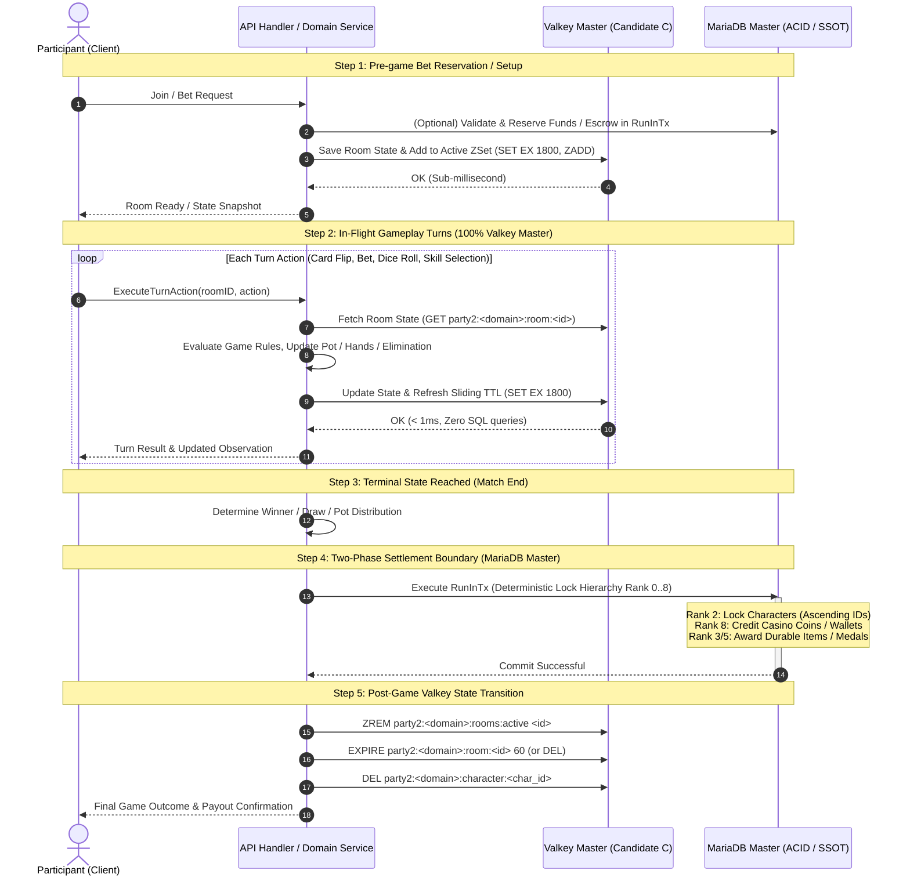

# Transient Run & Session State Architecture (Candidates C & D)

This document establishes the architectural evaluation, schema design, sliding TTL lifecycles, crash-recovery semantics, and persistence boundaries for:
1. **Candidate C: Ephemeral Turn & Session Lobbies** (Multiplayer turn games, wait lobbies, and mini-games across domains: Party co-op lobbies, Colosseum PvP, Guild GvG, Casino Indian Poker / High-Low / Doppelganger, and future turn mini-games).
2. **Candidate D: In-Progress Run Buffers** (Single-player and co-op multi-turn exploration and survival gauntlets: Dungeon exploration and Endurance Challenge sessions).

Per **RFC #356** and [`.agents/rules/05-database-and-caching.md`](../../.agents/rules/05-database-and-caching.md), both patterns decouple transient high-frequency turn mutations from relational persistence, converging on **Valkey Master** for in-flight gameplay and **MariaDB Master** for atomic Two-Phase Settlement.

> [!NOTE]
> **Implementation Status**:
> - **Candidate C (Standard Pattern)**: Formalized in Issue #635.
>   - **Party Lobbies**: Active in `internal/party` (Valkey Master `party2:party:lobby:*`, sliding 15m TTL; legacy `parties` MariaDB tables dropped in Migration 052).
>   - **Colosseum PvP**: Active in `internal/pvp` (Valkey Master `party2:pvp:room:*`, sliding 30m TTL).
>   - **Guild GvG**: Active in `internal/gvg` (Valkey Master `party2:gvg:room:*`, sliding 30m TTL).
>   - **Casino (High-Low, Doppelganger, Indian Poker)**: Target for Valkey migration from legacy MariaDB tables (`casino_rooms`, `casino_room_members`).
> - **Candidate D (In-Progress Run Buffers)**: Active in production.
>   - **Dungeon Exploration**: Completed in [#404](https://github.com/witchcraze/party2re/issues/404) (Valkey Master `party2:dungeon:{char:<char_id>}:state|rewards`, atomic Lua `dungeon_step.lua`, sliding 2h TTL, Two-Phase Settlement).
>   - **Endurance Challenge**: Completed in [#405](https://github.com/witchcraze/party2re/issues/405) (Valkey Master `party2:challenge:{char:<char_id>}:session|rewards`, atomic Lua `challenge_round.lua`, sliding 2h TTL, Two-Phase Settlement).

---

## 1. Architectural Role & Comparative Persistence Matrix

| Dimension | Candidate C: Ephemeral Turn & Session Lobbies | Candidate D: In-Progress Run Buffers |
| :--- | :--- | :--- |
| **Target Domains** | `party`, `pvp`, `gvg`, `casino`, future turn mini-games | `dungeon`, `challenge` |
| **Interaction Model** | Multi-player concurrent turns, card flips, bet rounds, votes, ready checks | Multi-floor grid exploration, wave-by-wave survival gauntlets |
| **Storage Authority** | **Valkey Master** (Authoritative ephemeral store, NO permanent SQL table) | **Valkey Master** (Provisional run buffer, NO SQL table for active runs) |
| **TTL Lifecycle** | **1800s (30 minutes)** sliding TTL (authentic Party2 parity) | **7200s (2 hours)** sliding TTL |
| **Concurrency Model** | In-memory atomic mutations or atomic Lua scripts (`party_add_member`, etc.) | Single-threaded atomic Lua scripts (`dungeon_step`, `challenge_advance_round`) |
| **Hash Tagging** | `{lobby:<id>}` or `{room:<id>}` | `{char:<character_id>}` |
| **Settlement Phase** | MariaDB Master `RunInTx` (payouts, coins, GP, medals, ranking updates) | MariaDB Master `RunInTx` (provisional EXP, Gold, Medals, Items, clear records) |
| **Post-Game Key Cleanup** | Deleted immediately (`DEL`) or retained for 60s post-game review | Deleted immediately (`DEL`) upon settlement transaction commit |

---

## Part I: Ephemeral Turn & Session Lobby Architecture (Candidate C)

### 2. Executive Summary & Problem Context

In Party2 Re, multiplayer session-based features involve high-frequency turn interactions:
- **Casino Card Games (`internal/casino`)**: Multi-player Indian Poker (`party2/lib/casino_indian.cgi`), High-Low (`party2/lib/casino_highlow.cgi`), and Doppelganger (`party2/lib/casino_doppel.cgi`). Players flip cards, raise bets, make high/low guesses, and eliminate contenders over 5–15 successive rounds.
- **Colosseum PvP (`internal/pvp`)**: 2–8 player room matchmaking, Bet & Split prize pool mechanics, team color assignment, and multi-round combat resolution.
- **Guild GvG Combat (`internal/gvg`)**: 2–8 player guild battle rooms, GP seeding, and multi-round elimination.
- **Future Turn Mini-games**: Turn-based board games (e.g. Sugoroku) and seasonal event mini-games.

#### The Relational SQL Bottleneck
Implementing transient turn and room states directly in relational MariaDB tables (such as `casino_rooms` and `casino_room_members`) causes severe architectural problems:
1. **Severe Database Write Amplification**: Every individual card flip, call, or bet update executes synchronous SQL `UPDATE` queries against MariaDB Master.
2. **Connection Pool Contention**: Active game turns occupy MariaDB connections during application execution, reducing connection availability for essential services (authentication, shops, depot).
3. **Table & Row Lock Contention**: Concurrent players interacting with the same room row trigger lock waits or deadlocks under high load.
4. **Data Truncation Bugs on Durable Tables**: Transient multi-winner or multi-member states stored in fixed-length SQL columns cause truncation crashes (e.g. `winner_character_id CHAR(32)` multi-winner bug resolved in #630).
5. **Abandoned Session Leaks & Cron Sweepers**: Abandoned rooms linger indefinitely unless cleaned by periodic background SQL sweepers (`PurgeIdleRooms`), creating unnecessary database load.

#### The Architectural Solution: Candidate C Standard Pattern
By standardizing Ephemeral Turn & Session Lobbies on **Valkey Master**:
- All high-frequency turn actions, card flips, bets, and ready states execute in Valkey in **sub-millisecond time (< 1ms)** with zero MariaDB queries.
- Sliding TTL (1800s / 30 minutes) automatically purges inactive or abandoned rooms natively without background SQL cron sweepers.
- Active room discovery executes in $O(1)$ time via a TTL-scored Sorted Set index.
- Economic payouts and durable statistics are settled atomically into MariaDB Master via **Two-Phase Settlement** (`RunInTx`).

---

### 3. Standardized Valkey Keyspace & Data Structures

All Candidate C implementations MUST conform to the following key pattern hierarchy:

| Key Pattern / Template | Storage Tier | Data Type | Expiration Policy (TTL) | Value / Serialization Format | Purpose & Invariant Guarantees |
| :--- | :--- | :--- | :--- | :--- | :--- |
| `party2:<domain>:room:<room_id>` | Valkey Master | `String (JSON)` | 1800s (30m), sliding | JSON (`RoomState`: config, members, deck, current turn, pot, status) | Authoritative ephemeral room state. Refreshed on every player interaction. |
| `party2:<domain>:rooms:active` | Valkey Master | `Sorted Set (ZSet)` | None (Dynamic index) | Member: `room_id`, Score: `UpdatedAt.Unix()` (or `CreatedAt.Unix()`) | Active public room index for $O(1)$ discovery and lazy expired room pruning. |
| `party2:<domain>:character:<character_id>` | Valkey Master | `String` | 1800s (30m), sliding | `room_id` (`string`) | Single active room per character invariant across the domain. |
| `party2:<domain>:room:<room_id>:turns` | Valkey Master | `List` or `Stream` | 1800s (30m), sliding | Serialized turn action entries | Optional turn action log for client replay and audit trail. |

*(For cluster hash tagging in multi-key operations or Lua scripts, wrap the co-locating room entity in curly braces: `party2:<domain>:{room:<room_id>}:state`)*.

---

### 4. Sliding TTL Lifecycle & Automatic Native Purging (1800s Parity)

In authentic Party2 (`party2/lib/casino.cgi:38, 124-129` and `party2/lib/quest.cgi:50`), multiplayer rooms have an authentic idle timeout of **1800 seconds (30 minutes)** without log update:

```perl
# party2/lib/casino.cgi:38
$auto_delete_casino_time = 1800;

# party2/lib/quest.cgi:50
$auto_delete_quest_time = 1800;
```

Candidate C strictly adopts this authentic 1800-second sliding lifecycle:

1. **Sliding Expiration on Every Mutation**:
   Every participant action (room creation, joining, bet placement, card flip, vote, ready toggle) updates the room state and automatically extends the room key's TTL via `EXPIRE party2:<domain>:room:<room_id> 1800`.
2. **Native Zero-Maintenance Eviction**:
   If participants abandon a match, Valkey natively evicts the room key after 1800 seconds of inactivity. No SQL `DELETE` queries or background cron daemons are required.
3. **Lazy Index Pruning ($O(\log N + M)$)**:
   Whenever active rooms are listed (`ListRooms`), the query executes lazy index cleanup before retrieving active entries:
   ```text
   ZREMRANGEBYSCORE party2:<domain>:rooms:active -inf <now_unix - 1800>
   ZRANGE party2:<domain>:rooms:active 0 -1
   ```
   This guarantees that lobby queries never return stale or expired rooms.

---

### 5. Two-Phase Settlement Lifecycle

Candidate C enforces a strict **Two-Phase Settlement** boundary between ephemeral turn execution and durable relational persistence:



#### Step Breakdown:
1. **Phase 1: Pre-game Reservation (Optional / Domain-Specific)**:
   - For games requiring an entry fee or bet escrow (e.g. Casino coin bets, PvP gold bets), the application verifies or debits funds upfront in MariaDB Master.
   - The room is seeded in Valkey Master with sliding TTL 1800s.
2. **Phase 2: In-Flight Turns (100% Valkey Master)**:
   - High-frequency turn decisions (card flips, bets, folds, dice rolls, elimination checks) mutate only Valkey Master.
   - Zero SQL queries or database row locks occur during gameplay.
   - Latency remains sub-millisecond (< 1ms).
3. **Phase 3: Terminal Resolution & Two-Phase Settlement**:
   - When the game reaches terminal status (`finished`, `completed`, `draw`), an atomic MariaDB transaction (`RunInTx`) is opened.
   - Locks are acquired adhering to the deterministic Rank 0..8 hierarchy:
     - Rank 2 Character: Lock character records in ascending ID order.
     - Rank 8 Casino Account: Credit won coins to winner accounts.
     - Rank 3 Inventory / Rank 5 Depot: Award physical prizes or victory medals.
   - Durable audit records (match history, news announcements) are inserted.
   - Transaction commits.
4. **Phase 4: Post-Game Valkey Cleanup**:
   - The room ID is removed from `party2:<domain>:rooms:active` (`ZREM`).
   - Character mapping keys are cleared (`DEL party2:<domain>:character:<char_id>`).
   - The room state key is either deleted immediately (`DEL`) or set to a short 60-second TTL (`EXPIRE room 60`) for post-game client viewing/animations.

#### Strict Persistence Invariants:
1. **Zero Premature Credit**: No currency, coin, item, or score buffered in Valkey may be credited to persistent character assets until the MariaDB transaction commits.
2. **Idempotent Settlement**: The settlement endpoint or transition handler must use CAS or state verification (`status != 'finished'`) so repeated finalization calls cannot duplicate payouts.

---

### 6. Disconnection, Inactivity & Abandonment Semantics

Multiplayer rooms must handle network disconnects and player abandonment deterministically:
1. **Player Turn Timeout**:
   - Each player turn is governed by a turn timer (e.g. 12s/18s/28s matching legacy speed settings `%speeds` in `casino.cgi` and `quest.cgi`).
   - If a participant fails to act within their turn window, the system automatically triggers default fallback behavior:
     - **Indian Poker**: Auto-fold or auto-check.
     - **High-Low / Doppelganger**: Auto-elimination / forfeiture.
2. **Match Abandonment**:
   - If all participants disconnect or abandon the room, the sliding 1800s TTL natively evicts the room key.
   - If escrowed bets were collected in Phase 1, an unfinalized abandoned room that reaches TTL expiration forfeits escrowed amounts or refunds participants via an idempotent settlement reconciler.

---

### 7. Implementation Blueprint & Status for Casino Migration

`internal/casino` formerly implemented multiplayer rooms via MariaDB Master tables (`casino_rooms`, `casino_room_members`). The migration to Candidate C has progressed as follows:

1. **Step 1: Keyspace Standardization & Repository Implementation (Completed in Issue #635)**:
   - Implemented `ValkeyRoomRepository` in `internal/casino` backed by Valkey Master:
     - `party2:casino:room:<room_id>`: JSON `RoomDetail` holding room configuration, participants, deck, pot, and game status.
     - `party2:casino:rooms:active`: Sorted Set for active room discovery and lazy TTL pruning.
     - `party2:casino:character:<character_id>`: Single active room pointer with 1800s sliding TTL.
2. **Step 2: Service Wire & Two-Phase Settlement (Completed in Issue #635)**:
   - Wired `casino.Service` in `cmd/party2` to use `ValkeyRoomRepository` when `valkeyClient` is configured.
   - All card actions (`JoinRoom`, `UpdateBet`, `NextCard`, `DrawCard`, `StartRound`) execute against `ValkeyRoomRepository` with sub-millisecond latency.
   - On game completion (`status == finished`), open a single MariaDB transaction (`RunInTx`) to credit coins to `casino_accounts` (Rank 8) for the winner(s).
3. **Step 3: Database Schema Deprecation & Cleanup (Completed in Issue #635)**:
   - Retained durable financial table: `casino_accounts` (SSOT for coin balances).
   - Dropped ephemeral tables via Migration 085: `DROP TABLE casino_members; DROP TABLE casino_rooms;` (mirroring Migration 052 for `parties` and `party_members`).
   - Removed dead relational repository `internal/database/casino_room_repository.go` and replaced fallback in `cmd/party2` with thread-safe `casino.NewMemoryRoomRepository()`.

---

## Part II: In-Progress Run Buffers Architecture (Candidate D)

### 8. Executive Summary & Problem Context

In Party2 Re, multi-turn exploration and survival mini-games involve high-frequency player interactions:
- **Dungeon Exploration (`internal/dungeon`)**: Players navigate multi-floor grid labyrinths (3–5 floors, 20–40 tiles per floor). Every tile step triggers coordinate updates, stamina/turn consumption, HP/MP alterations, and tentative reward accumulation.
- **Endurance Challenge (`internal/challenge`)**: Players fight successive monster waves (20–100+ rounds) with scaling difficulty, accumulating provisional EXP, Gold, and milestone item drops per wave.

#### The Current Relational Bottleneck
Historically, intermediate state was saved directly into relational MariaDB tables:
- Every dungeon move updated `dungeon_active_expeditions` (coordinates, remaining turns, HP, and a JSON column of accumulated drops).
- Every challenge round updated `challenge_sessions` (round counter, HP, and accumulated rewards JSON).

Writing intermediate turn state directly to MariaDB causes:
1. **Severe Write Amplification**: A single dungeon expedition produces 60–120 synchronous SQL `UPDATE` queries. 50 concurrent explorers generate thousands of database writes per minute purely for tentative state.
2. **Connection Pool Contention**: Each step occupies a MariaDB connection during application execution, reducing connection availability for player authentication, shops, and financial transactions.
3. **JSON Column Rewrites**: MariaDB must re-serialize and write entire JSON arrays of provisional loot on every single tile or wave.
4. **Table Bloat from Abandoned Sessions**: Players who close their browser mid-run leave orphaned rows in MariaDB requiring periodic cleanup sweeper crons.

#### The Architectural Solution: Candidate D
Per **RFC #356** (Persistence Boundary Guidelines), provisional working buffers that are only committed upon exit or cashout are prime candidates for **Valkey Master**.

By migrating active run buffers to Valkey Master with **Valkey Lua Scripting**:
- All high-frequency moves and turn resolutions execute in Valkey in **sub-millisecond time (< 1ms)** with zero MariaDB queries.
- Atomic Lua scripts prevent race conditions and eliminate application-level distributed locks.
- Sliding TTL (2 hours) automatically evicts abandoned sessions without database sweepers.
- Final settlement executes as an atomic **Two-Phase Settlement** into MariaDB Master (`RunInTx`), guaranteeing 100% economic and progression durability.

---

### 9. Performance & Concurrency Trade-Offs

| Metric / Dimension | Current MariaDB Architecture | Proposed Valkey Master Architecture |
| :--- | :--- | :--- |
| **Active Turn Mutation Latency** | 5ms – 25ms (SQL parse, disk sync/buffer pool, InnoDB locking) | 0.2ms – 0.8ms (Single-threaded in-memory Lua execution) |
| **Write Amplification on DB** | High (1 write per tile/round, rewriting full JSON loot columns) | Zero during active runs (0 SQL queries while exploring) |
| **Concurrency & Row Locking** | Row-level locking (`SELECT ... FOR UPDATE`), risk of contention under rapid inputs | Single-threaded atomic evaluation in Valkey; zero application locking required |
| **Connection Pool Impact** | Consumes pooled SQL connections on every player move | Single multiplexed TCP client; zero MariaDB connection pool pressure |
| **Abandoned Session Cleanup** | Orphaned records remain indefinitely until swept by batch cron | Native sliding TTL (`7200s` / 2 hours) automatically evicts expired state |
| **Durability Guarantee** | Relational ACID (InnoDB redo/undo logs) | Ephemeral in-flight buffer with AOF fsync (`everysec`); MariaDB ACID upon settlement |

---

### 10. Storage Authority & Two-Phase Settlement Boundary

Storage authority strictly respects the hierarchical decision tree in [`.agents/rules/05-database-and-caching.md`](../../.agents/rules/05-database-and-caching.md):
- **MariaDB Master**: Canonical Single Source of Truth for durable assets (wallets, permanent inventory, character progression, and permanent audit logs).
- **Valkey Master**: Primary authoritative store for **in-flight working buffers** during active sessions. No SQL rows exist for active runs.

```text
┌─────────────────────────────────────────────────────────────────────────────────────────┐
│ Phase 1: Session Initiation (MariaDB Gate -> Valkey Seed)                               │
│ 1. Validate entry prerequisites (min level, character status)                           │
│ 2. Debit entry fee / stamina in MariaDB transaction if applicable                        │
│ 3. Initialize run buffer keys in Valkey Master with 2-hour sliding TTL                  │
└────────────────────────────────────────────┬────────────────────────────────────────────┘
                                             │
                                             ▼
┌─────────────────────────────────────────────────────────────────────────────────────────┐
│ Phase 2: In-Flight Active Run (100% Valkey Master via Atomic Lua)                       │
│ - Advance coordinates or wave rounds atomically via Lua scripts                         │
│ - Validate HP > 0 and turn allowances within the script                                 │
│ - Buffer provisional EXP, Gold, Medals, and Item Drops                                  │
│ - Refresh 2-hour sliding TTL on every atomic mutation                                   │
│ - ZERO MariaDB queries or locks                                                         │
└────────────────────────────────────────────┬────────────────────────────────────────────┘
                                             │
                                             ▼
┌─────────────────────────────────────────────────────────────────────────────────────────┐
│ Phase 3: Two-Phase Settlement Boundary (Valkey Buffer -> MariaDB Master)                │
│ 1. Read accumulated tentative rewards from Valkey buffer                                │
│ 2. Execute MariaDB Unit of Work (RunInTx):                                              │
│    - Acquire exclusive lock on Character (Rank 2)                                       │
│    - Acquire exclusive lock on Inventory / Equipment (Rank 3)                           │
│    - Apply final rewards (EXP, Gold, Medals, Items) or defeat penalty (50% / forfeiture)│
│    - Insert permanent record (dungeon_history / challenge_records)                      │
│    - Commit transaction                                                                 │
│ 3. On MariaDB commit success: Delete Valkey run buffer keys (DEL)                       │
└─────────────────────────────────────────────────────────────────────────────────────────┘
```

#### 10.1 Strict Persistence Invariants
1. **Zero Premature Credit**: No reward (item, currency, or experience) buffered in Valkey may be credited to permanent character inventory or stats until MariaDB transaction successfully commits.
2. **Defeat / Forfeiture Guarantee**: If a player wipes out or runs out of turns, penalty rules (e.g. 50% EXP/Gold consolation, item loss) are computed deterministically from the buffered state during the settlement transaction.
3. **Idempotent Finalization**: The finalization endpoint uses CAS or one-time token consumption to prevent duplicate cashout claims. Once settled in MariaDB, repeated requests return the final result without re-awarding rewards.

---

### 11. Crash Recovery & Failure Semantics

#### 11.1 Application Server Crash or Restart
- **Valkey Durability**: Valkey operates with Append-Only File (`AOF`) set to `appendfsync everysec`. At most 1 second of in-flight moves could be lost during an abrupt host power outage.
- **Application Disconnection / Pod Restart**: On application server restart, Valkey is unaffected. When the player reconnects, `GetActiveExpedition` or `GetActiveChallenge` reads the active session from Valkey. The player resumes their run exactly where they left off.
- **Player Abandonment**: If the player closes their browser and never returns, the session key's sliding TTL (2 hours) expires cleanly. Valkey frees the memory automatically with zero orphaned SQL rows.

#### 11.2 Settlement Failure Recovery (Two-Phase Atomicity)
- **Scenario A: Crash during Phase 3 before MariaDB commits**:
  MariaDB automatically rolls back the uncommitted transaction. The Valkey run buffer remains intact. The player can retry settlement or continue the run. No items or currencies are duplicated or lost.
- **Scenario B: Crash after MariaDB commits but before Valkey `DEL` executes**:
  MariaDB has permanently recorded the completed run. Upon subsequent query, the service checks MariaDB history or status, determines that the expedition/session was already finalized, and issues the cleanup `DEL` to Valkey. Double-claiming is strictly impossible because MariaDB is the authority.

---

### 12. Keyspace Schema & Cluster Hash Tagging

Per Section 2.3 of `docs/architecture/valkey-keyspace.md`, all multi-key operations touched by a Lua script MUST enclose their dynamic co-locating entity identifier in curly braces `{...}` to guarantee hash slot colocation in clustered topologies.

Because each character may have at most **one** active dungeon expedition and **one** active challenge session at any time, `{char:<character_id>}` serves as the co-locating hash tag:

#### 12.1 Dungeon Exploration Keyspace

| Key Pattern | Storage Tier | Data Type | TTL Policy | Description & Fields |
| :--- | :--- | :--- | :--- | :--- |
| `party2:dungeon:{char:<character_id>}:state` | Valkey Master | `Hash` | 2 hours (`7200s`), sliding | Hash fields: `expedition_id`, `character_id`, `dungeon_id`, `current_floor`, `pos_x`, `pos_y`, `current_hp`, `turns_remaining`, `status`, `started_at`, `updated_at`. |
| `party2:dungeon:{char:<character_id>}:rewards` | Valkey Master | `Hash` | 2 hours (`7200s`), sliding | Hash fields: `exp` (int), `gold` (int), `medals` (int), `items` (JSON array string). |
| `party2:dungeon:{char:<character_id>}:revealed` | Valkey Master | `Set` | 2 hours (`7200s`), sliding | Set of visited `floor:x:y` coordinates for fog-of-war exploration tracking. |

#### 12.2 Endurance Challenge Keyspace

| Key Pattern | Storage Tier | Data Type | TTL Policy | Description & Fields |
| :--- | :--- | :--- | :--- | :--- |
| `party2:challenge:{char:<character_id>}:session` | Valkey Master | `Hash` | 2 hours (`7200s`), sliding | Hash fields: `session_id`, `character_id`, `tier_id`, `current_round`, `current_hp`, `status`, `created_at`, `updated_at`. |
| `party2:challenge:{char:<character_id>}:rewards` | Valkey Master | `Hash` | 2 hours (`7200s`), sliding | Hash fields: `exp` (int), `gold` (int), `items` (JSON array string). |

---

### 13. Lua Script Contracts & Specification

In accordance with [`.agents/rules/05-database-and-caching.md`](../../.agents/rules/05-database-and-caching.md) Section 3.5, Lua scripts must:
- Complete in `< 1ms` with complexity `<= O(log N)`.
- Use hash tagging for all `KEYS[...]`.
- Enforce invariant checks atomically.

#### 13.1 `dungeon_step` Contract
Advances player position in a dungeon floor, decrements turns, adjusts HP, accumulates tentative rewards, and refreshes the 2-hour sliding TTL in a single atomic round-trip.

- **Script Identifier**: `dungeon_step`
- **Target Keys**:
  - `KEYS[1]`: State Key (`party2:dungeon:{char:<character_id>}:state`)
  - `KEYS[2]`: Rewards Key (`party2:dungeon:{char:<character_id>}:rewards`)
- **Arguments**:
  - `ARGV[1]`: `expected_expedition_id` (string)
  - `ARGV[2]`: `new_floor` (string integer)
  - `ARGV[3]`: `new_x` (string integer)
  - `ARGV[4]`: `new_y` (string integer)
  - `ARGV[5]`: `hp_delta` (string integer: negative for damage, positive for recovery)
  - `ARGV[6]`: `turns_delta` (string integer, e.g. `-1`)
  - `ARGV[7]`: `exp_delta` (string integer)
  - `ARGV[8]`: `gold_delta` (string integer)
  - `ARGV[9]`: `medals_delta` (string integer)
  - `ARGV[10]`: `reward_item_id` (string, empty if none)
  - `ARGV[11]`: `now_unix` (string integer)
  - `ARGV[12]`: `ttl_seconds` (string integer, `7200`)
- **Preconditions & Atomic Invariants**:
  1. `KEYS[1]` must exist. If not, return error string `"ERR_EXPEDITION_NOT_FOUND"`.
  2. `status` must be `"exploring"`. If not, return `"ERR_EXPEDITION_NOT_ACTIVE"`.
  3. Stored `expedition_id` must match `expected_expedition_id`. If not, return `"ERR_EXPEDITION_ID_MISMATCH"`.
  4. If `current_hp + hp_delta <= 0`: set `status = "wiped_out"`, `current_hp = 0`.
  5. If `turns_remaining + turns_delta <= 0`: set `status = "wiped_out"`.
- **Mutations**:
  - Update `current_floor`, `pos_x`, `pos_y`, `current_hp`, `turns_remaining`, `updated_at`.
  - Increment rewards (`exp`, `gold`, `medals`).
  - If `reward_item_id != ""`, append to `items` JSON array.
  - Refresh TTL on both `KEYS[1]` and `KEYS[2]` via `redis.call('EXPIRE', key, ttl_seconds)`.
- **Return Value**:
  - Array containing updated status, floor, x, y, hp, remaining turns, and reward totals.

#### 13.2 `challenge_advance_round` Contract
Advances the survival challenge wave round, records surviving HP, accumulates monster defeat rewards, and refreshes sliding TTL.

- **Script Identifier**: `challenge_advance_round`
- **Target Keys**:
  - `KEYS[1]`: Session Key (`party2:challenge:{char:<character_id>}:session`)
  - `KEYS[2]`: Rewards Key (`party2:challenge:{char:<character_id>}:rewards`)
- **Arguments**:
  - `ARGV[1]`: `expected_session_id` (string)
  - `ARGV[2]`: `surviving_hp` (string integer)
  - `ARGV[3]`: `exp_delta` (string integer)
  - `ARGV[4]`: `gold_delta` (string integer)
  - `ARGV[5]`: `reward_item_id` (string, empty if none)
  - `ARGV[6]`: `now_unix` (string integer)
  - `ARGV[7]`: `ttl_seconds` (string integer, `7200`)
- **Preconditions & Atomic Invariants**:
  1. `KEYS[1]` must exist. If not, return `"ERR_SESSION_NOT_FOUND"`.
  2. `status` must be `"active"`. If not, return `"ERR_SESSION_NOT_ACTIVE"`.
  3. Stored `session_id` must match `expected_session_id`. If not, return `"ERR_SESSION_ID_MISMATCH"`.
- **Mutations**:
  - Increment `current_round` by 1.
  - Set `current_hp = surviving_hp`.
  - Increment rewards (`exp`, `gold`).
  - If `reward_item_id != ""`, append to `items` JSON array.
  - Update `updated_at`.
  - Refresh TTL on both keys via `redis.call('EXPIRE', key, ttl_seconds)`.
- **Return Value**:
  - Array containing new round number, surviving HP, total accumulated EXP, Gold, and items count.

---

### 14. In-Memory Fallback Parity & Test Mocking Guidelines

To comply with the project requirement for zero mock divergence:
1. **Thread Safety**: Any in-memory mock repository (`internal/dungeon/memory_repository.go` or `internal/valkey/memory.go`) MUST protect in-memory maps using `sync.RWMutex`.
2. **Error String & Behavior Parity**:
   The Go in-memory mock MUST return exact error constants matching Lua script return codes:
   - `ERR_EXPEDITION_NOT_FOUND`
   - `ERR_EXPEDITION_NOT_ACTIVE`
   - `ERR_EXPEDITION_ID_MISMATCH`
   - `ERR_SESSION_NOT_FOUND`
   - `ERR_SESSION_NOT_ACTIVE`
   - `ERR_SESSION_ID_MISMATCH`
3. **Contract Test Suites**:
   Unit tests verifying `dungeon.Service` and `challenge.Service` must be parameterized to execute against both:
   - Live Valkey instance with preloaded Lua scripts (`valkey.NewLuaScript`).
   - In-memory Go fallback mock.
   This guarantees that local development and CI container runs behave identically.

---

### 15. Migration Plan & Database Schema Evolution

When implementing Candidate D in subsequent production tickets:
1. **Phase 1 (Dual Interface)**: Introduce `ValkeyExpeditionRepository` and `ValkeyChallengeRepository` alongside existing SQL repositories.
2. **Phase 2 (Two-Phase Settlement Service)**: Wire services to use Valkey for `Start`, `Move`, `AdvanceRound` while retaining MariaDB `RunInTx` for `Escape`, `Clear`, `Cashout`, and `Defeat`.
3. **Phase 3 (Schema Deprecation)**:
   - Retain durable relational tables: `character_dungeon_records`, `dungeon_expedition_history`, `character_challenge_records`.
   - Remove ephemeral active tables via a dedicated migration: `DROP TABLE dungeon_active_expeditions` and `DROP TABLE challenge_sessions` (following the precedent of Migration 052 dropping `parties` and `party_members`).
