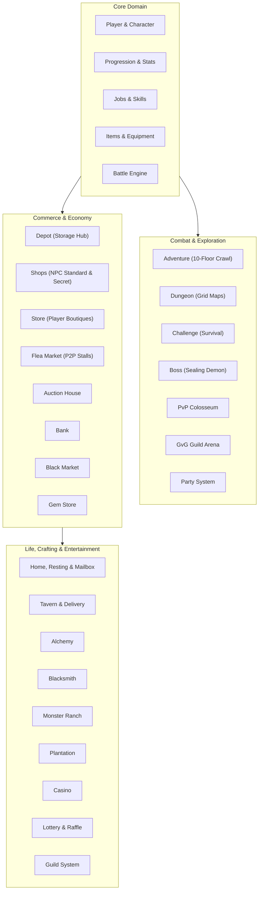

# Domain Design Specifications & SSOT Index

This directory serves as the **Single Source of Truth (SSOT)** for enduring game and domain rules in Party2 reconstruction (`party2re`), per [`.agents/rules/02-documentation-sync.md`](../../.agents/rules/02-documentation-sync.md).

Specifications here represent language-agnostic gameplay mechanics, formulas, caps, state machines, and system boundaries derived faithfully from the original Party2 Perl CGI reference codebase (`party2/`).

---

## Domain Architecture Map

---

## Canonical Design Document Sitemap

### 1. Account, Identity & Character Foundation
- [`player-and-character.md`](player-and-character.md) — Account authentication, character identity, wallet (999,999G), vitality, crystal currency, and fatigue caps.
- [`character-customization.md`](character-customization.md) — Naming hall, gender changes, title display, and custom font colors (`#RRGGBB`).
- [`api-tokens.md`](api-tokens.md) — Personal Access Tokens (`p2_sk_...`) and dual authentication.
- [`player-deletion.md`](player-deletion.md) — Account deletion, asset cleanup, and maintenance lifecycle.
- [`system-maintenance.md`](system-maintenance.md) — Maintenance mode toggle, admin controls, and 503 middleware.
- [`notifications.md`](notifications.md) — Server news articles and character notification inboxes.

### 2. Character Progression, Jobs & Skills
- [`progression.md`](progression.md) — Cumulative experience thresholds ($10 \times \text{Level}^2$), Level 99 baseline, stats, and celestial OverLevel (Lv 150).
- [`jobs-and-skills.md`](jobs-and-skills.md) — 72-job catalog, Level 20 job changes, job mastery, and skill activation mechanics.
- [`items-and-equipment.md`](items-and-equipment.md) — 5-category item catalog, equipment invariants, and consumption helpers.
- [`custom_skill.md`](custom_skill.md) — Custom skill synthesis using 3-gem formulas and trigger phrase matching.
- [`wishing-well.md`](wishing-well.md) — Wishing Well (願いの泉, @女神) SP sacrifice exchange for permanent stat boosts.
- [`god.md`](god.md) — 19 celestial god wishes, limit breaks, and OverLevel blessings.

### 3. Combat, Adventure & Dungeon Exploration
- [`battle.md`](battle.md) — Deterministic turn resolver, multi-participant factions, status effects, formulas, and Battle Adapter.
- [`stages-and-monsters.md`](stages-and-monsters.md) — 28-stage adventure catalog and 286 clean-room monsters.
- [`adventure.md`](adventure.md) — Sequential 10-floor dungeon crawl, Floor 11 treasure room, adventure chronicle history, and milestone unlocks.
- [`dungeon.md`](dungeon.md) — 2D grid tile matrix exploration, hazard traps, `@ちず` scouting jobs, and escape portals.
- [`challenge.md`](challenge.md) — Continuous wave survival trial, enemy stat scaling, no inter-round healing, and Hall of Fame.
- [`boss.md`](boss.md) — 4-player cooperative Sealing Demon battles, Proof of Kingship, Dejon banishment, and victory banquets.
- [`party-system.md`](party-system.md) — 1–4 player co-op adventure lobbies, speed configuration, `need_join` condition gates, and synergy bonuses.
- [`pvp.md`](pvp.md) — Colosseum real-time 2..8 player Bet & Split arena, 9 team colors, and multi-round combat resolution.
- [`gvg.md`](gvg.md) — Guild vs Guild 2..8 player live matches, GP prize pools, target wins, and 7-tier championship medals.
- [`replay.md`](replay.md) — Combat turn log recording, step-by-step playback, and match history queries.

### 4. Commerce, Storage & Economy
- [`depot.md`](depot.md) — Central storage hub (up to 500 slots), tiered expansion, direct item delivery, and dual-source consumption.
- [`shops.md`](shops.md) — Standard NPC shops (Weapon, Armor, Item) at 2x price / 50% resale, and Secret Underground Shop (@ヒミツジ, JobLv 7 gate, 3x price, puff-puff).
- [`store.md`](store.md) — Player boutique real-estate (50,000G in towns 1–4, 90-day cycle), 26 wallpapers, 15 furnitures, and depot barter/gold sales.
- [`fleamarket.md`](fleamarket.md) — Player-to-player free market stalls (server-wide 120 listing ceiling, direct depot transfer).
- [`auction.md`](auction.md) — Live P2P trade hall (`@おくる`/`@しらべる`) with uninitialized recipient depot auto-provisioning.
- [`bank.md`](bank.md) — Gold savings deposits and withdrawals with 999,999G wallet clamp.
- [`black-market.md`](black-market.md) — Rare item sacrifice recycling for Rare Points and 24 equipment/item rewards.
- [`gemstore.md`](gemstore.md) — Dedicated gem box storage, 55+ synthesis formulas, and dual-source orb appraisal.
- [`medal.md`](medal.md) — Small Medal depot exchange and character lifetime milestone achievements.
- [`achievements.md`](achievements.md) — Lifetime gameplay milestones, achievement categories, and tracking criteria.

### 5. Living, Towns & Crafting
- [`home.md`](home.md) — Private town estate construction (towns 1–4), companion phrase training, player mailbox (independent deletion), and free sleep recovery (`sleep.cgi`).
- [`town_park.md`](town_park.md) — Public bulletin board messaging, NPC dialogs, and daily fortune divinations (@町娘).
- [`tavern.md`](tavern.md) — Adventurer's Tavern 14-item culinary menu, restorative meals, fullness tracking, raffle tickets, and post-adventure standing order delivery.
- [`alchemy.md`](alchemy.md) — 112 crafting recipes consuming depot materials, recipe compendium, and overnight home sleep synthesis.
- [`blacksmith.md`](blacksmith.md) — 12 authentic crystal weapon seals, equipment naming, and 3-slot dedicated weapon storage.
- [`monster.md`](monster.md) — Monster Grandpa ranch stabling (50–300 cap), Home pet companions (up to 8), renaming, P2P gifting, and wild release.
- [`plantation.md`](plantation.md) — Seed cultivation with 6 seeds, 14 fertilizer reagents, midnight JST maturation, and depot harvest delivery.
- [`oracle-shop.md`](oracle-shop.md) — Oracle Shop (@ラクル) job-gated costume rentals, gender icons, private estate wallpaper boutique, and Black Market hint.
- [`chapel.md`](chapel.md) — 5 town church blessings with single-active prayer constraint and daily reset.
- [`altar-of-rebirth.md`](altar-of-rebirth.md) — 6-orb ritual offering, Ramia awakening, and 4 otherworld travel item wishes.

### 6. Social, Community & Gambling
- [`guild.md`](guild.md) — Guild founding, dynamic GP, custom roles, hex colors, broadcast callouts, and 20-day inactivity auto-disbandment.
- [`eventplaza.md`](eventplaza.md) — Real-time 5-minute concurrency presence tracking, 3x markup traveling merchant bazaar, and victory banquets.
- [`casino.md`](casino.md) — Multi-player room lobby (2..8 players), Indian Poker, High & Low, Doppelganger, solo 3-reel slot machine, and 18 authentic prizes routed to depot.
- [`lottery.md`](lottery.md) — Server-wide 20-ticket Takarakuji lottery with rollover jackpot, and Tavern Fukubiki raffle.
- [`photo-contest.md`](photo-contest.md) — 10-day seasonal cycles, screenshot submissions, community voting, prize delivery, and Hall of Fame.
- [`collection.md`](collection.md) — Illustrated monster encyclopedia and item discovery compendium with auto-record.
- [`ranking.md`](ranking.md) — 12 competitive leaderboards with Valkey snapshot caching and singleflight stampede guard.
- [`rescue-and-helper.md`](rescue-and-helper.md) — Emergency unstuck rescue with cooldown penalty, and 4-category helper quest board.
- [`activities.md`](activities.md) — Delayed background training actions with push-based worker resolution.
- [`game-overview.md`](game-overview.md) — High-level domain overview and feature expansion model.
