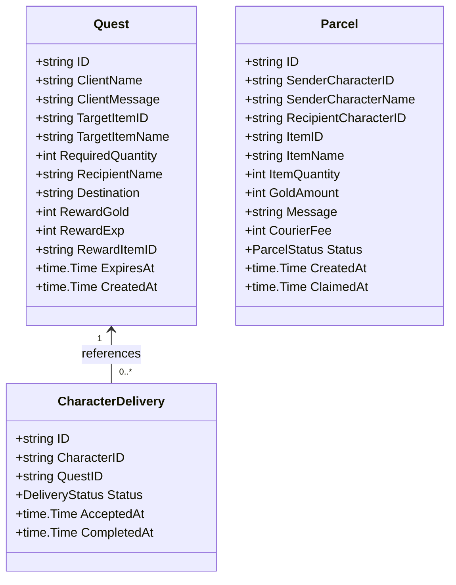

# Town Delivery Quests and Player-to-Player Courier Service Design Specification

## Overview

The Delivery subsystem modernizes and cleanly reconstructs the original Party2 `delivery.cgi` ("でりばりー") mechanics. It provides two core game loops:
1. **Town Delivery Quests**: NPC residents request deliveries of common items, medicines, or equipment to specific recipients across the game world. Fulfilling these quests grants Gold, Experience points, and rare bonus items.
2. **Player-to-Player Courier Service**: Players can dispatch items and gold to other registered player characters with personalized messages via town couriers, paying a modest flat service fee (50 G).

---

## 1. Domain Architecture & Invariants

### Invariants:
1. **Concurrent Active Delivery Limit**: A character can hold a maximum of 3 concurrent in-progress delivery quests (`MaxActiveDeliveries = 3`).
2. **Atomic Item Consumption & Reward Settlement**: Delivery completion verifies item possession under pessimistic row locks (`FOR UPDATE`), consumes items, adds gold/exp/bonus items, and updates delivery status within a single transaction boundary (`RunInTx`).
3. **Pessimistic Locking Hierarchy**: All transactions strictly follow the lock acquisition hierarchy to prevent deadlocks:
   - `characters` -> `inventory_items` -> `delivery_quests` / `character_deliveries` / `delivery_parcels`.
4. **Non-Self Parcel Delivery**: Characters cannot send courier parcels to themselves.
5. **Courier Fee**: A non-refundable 50 G flat courier fee is deducted from the sender upon parcel dispatch. If cancelled by the sender before claiming, the item and gold payload are refunded to the sender.

---

## 2. API Endpoints

| Method | Path | Summary | Authentication |
|---|---|---|---|
| `GET` | `/characters/{id}/delivery/quests` | List available town delivery quests | Bearer Token (Character Owner) |
| `GET` | `/characters/{id}/delivery/active` | List character's active delivery quests | Bearer Token (Character Owner) |
| `POST` | `/characters/{id}/delivery/accept` | Accept an available delivery quest | Bearer Token (Character Owner) |
| `POST` | `/characters/{id}/delivery/complete` | Complete quest, consume items, claim rewards | Bearer Token (Character Owner) |
| `POST` | `/characters/{id}/delivery/cancel` | Cancel an in-progress delivery quest | Bearer Token (Character Owner) |
| `POST` | `/characters/{id}/delivery/parcels/send` | Send item/gold courier parcel to player | Bearer Token (Character Owner) |
| `GET` | `/characters/{id}/delivery/parcels/incoming` | List incoming pending parcels | Bearer Token (Character Owner) |
| `POST` | `/characters/{id}/delivery/parcels/claim` | Claim incoming courier parcel payload | Bearer Token (Character Owner) |
| `POST` | `/characters/{id}/delivery/parcels/cancel` | Cancel outgoing pending parcel & refund payload | Bearer Token (Character Owner) |

---

## 3. Database Schema

- `delivery_quests`: Stores world delivery quest definitions with expiration timestamps.
- `character_deliveries`: Stores accepted quest progress (`in_progress`, `completed`, `cancelled`) linked to characters.
- `delivery_parcels`: Stores player-to-player mail parcels (`pending`, `claimed`, `cancelled`).
