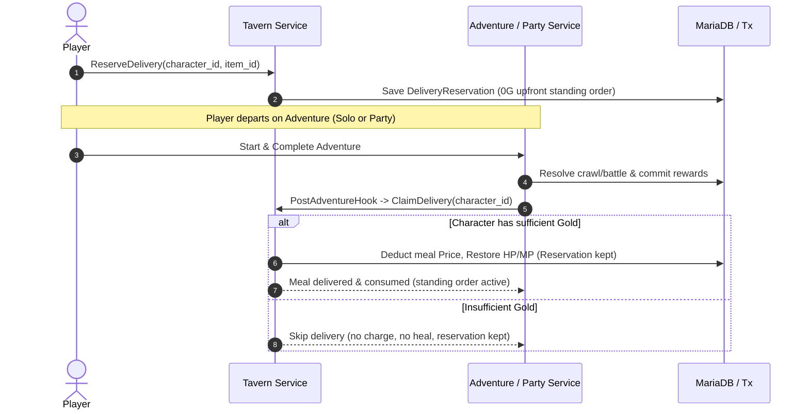

# Tavern Post-Adventure Food Delivery Design Specification

## Overview

The Food Delivery ("でりばりー") subsystem is part of the Adventurer's Tavern module (`internal/tavern`, `docs/design/tavern.md`).
In original Party2 (`party2/lib/bar.cgi`, `party2/lib/_battle.cgi`), delivery is NOT an NPC courier quest or parcel delivery system. It is a recurring standing meal reservation ("定期配達") made at the Tavern: an adventurer pre-orders food or drinks before heading out to adventure. When an adventure concludes (solo or party), the tavern automatically delivers the meal, restoring HP and MP, and deducting the meal cost. The reservation persists across subsequent adventures until explicitly canceled.

> [!NOTE]
> Fictional NPC delivery quests and player-to-player parcel mail previously implemented in `internal/delivery` have been completely purged (#475) in accordance with the clean-room migration policy.

---

## 1. Domain Architecture & Invariants



### Invariants:
1. **Zero Upfront Reservation Cost**: Reserving a delivery meal costs 0 G upfront (`party2/lib/bar.cgi:140`). Payment occurs upon successful delivery at adventure completion.
2. **Standing Order (Recurring Delivery)**: Reserving a delivery establishes a recurring contract. Successful delivery does NOT delete the reservation (`party2/lib/_battle.cgi:1348-1376`). The standing order persists and will deliver again after subsequent adventures.
3. **Single Active Reservation**: A character may hold at most one active delivery reservation at a time (`tavern_deliveries` keyed by `character_id`). Reserving another meal updates the active reservation.
4. **Cancellation Without Fee**: Players can cancel a pending delivery reservation at any time with zero penalty or fee (`DELETE /characters/{id}/tavern/delivery`, `party2/lib/bar.cgi:149`).
5. **No Fullness State Mutation**: Receiving a delivery meal does NOT set `IsFull = true`. Adventurers can still eat at the tavern counter or receive future deliveries.
6. **No Raffle Tickets on Delivery**: Unlike counter dining (`OrderMeal`), delivery meals do NOT award lottery raffle tickets (`coupon` is exclusive to `bar.cgi:113-117`).
7. **Automated Post-Adventure Trigger (Solo & Party)**: When a solo adventure or multiplayer party adventure completes, the registered `PostAdventureHook` automatically invokes `ClaimDelivery` for each participating character:
   - If the player has sufficient funds (`Money >= Price`), the meal cost is deducted and HP and MP are restored (clamped to `MaxHP` / `MaxMP`).
   - If funds are insufficient, delivery is skipped without deducting gold or applying restorative effects, the standing order remains active, and the error is treated as non-fatal so adventure rewards are not impeded.
8. **Direct Manual Claim**: Characters may also manually claim a pending delivery meal via `POST /characters/{id}/tavern/delivery/claim`.

---

## 2. API Endpoints

All food delivery endpoints are consolidated under the Tavern domain (`/characters/{id}/tavern/delivery`):

| Method | Path | Summary | Authentication |
|---|---|---|---|
| `POST` | `/characters/{id}/tavern/delivery` | Reserve a tavern meal for post-adventure delivery | Bearer Token / Session |
| `GET` | `/characters/{id}/tavern/delivery` | Inspect currently active delivery reservation | Bearer Token / Session |
| `DELETE` | `/characters/{id}/tavern/delivery` | Cancel active delivery reservation | Bearer Token / Session |
| `POST` | `/characters/{id}/tavern/delivery/claim` | Manually claim and consume reserved delivery meal | Bearer Token / Session |

---

## 3. Database Schema

The subsystem uses `tavern_deliveries` (`migrations/039_tavern.sql`):

```sql
CREATE TABLE IF NOT EXISTS tavern_deliveries (
    character_id CHAR(32) NOT NULL PRIMARY KEY,
    item_id VARCHAR(64) NOT NULL,
    item_name VARCHAR(128) NOT NULL,
    price INT NOT NULL,
    hp_heal INT NOT NULL,
    mp_heal INT NOT NULL,
    tickets INT NOT NULL DEFAULT 0,
    created_at TIMESTAMP NOT NULL DEFAULT CURRENT_TIMESTAMP,
    CONSTRAINT fk_tavern_deliveries_char FOREIGN KEY (character_id) REFERENCES characters (id) ON DELETE CASCADE
);
```

Legacy fictional tables `delivery_quests`, `character_deliveries`, and `delivery_parcels` have been purged via `migrations/069_drop_fictional_delivery_tables.sql`.
