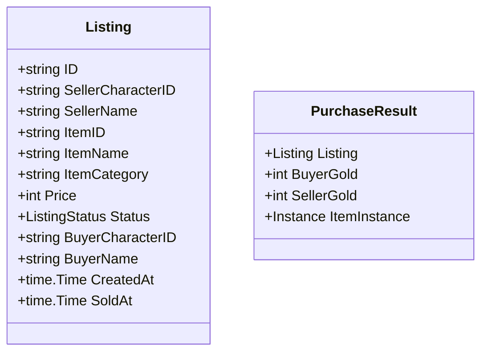

# Flea Market and Player Item Stall Design Specification

## Overview

The Flea Market (`fleamarket`) subsystem cleanly reconstructs and modernizes the original Party2 `free.cgi` ("フリーマーケット") mechanics.
In contrast to the auction house (bidding and timed auction settlement) and the NPC item shop (fixed 50% resale price), the Flea Market enables players to set up casual player-to-player stalls to list items from their inventory for direct fixed-price purchase by other adventurers.

---

## 1. Legacy `@actions` Reconciliation Table

| Legacy Action | Legacy Subroutine | Modern Go Domain Method | Modern HTTP Endpoint | Reconciliation Status & Rationale |
|---|---|---|---|---|
| `しゅっぴん` | `&syuppin` | `FleaMarketService.CreateListing` | `POST /characters/{id}/fleamarket/listings` | **Reconciled (1:1)**: Lists item from player's inventory at fixed price (1–999,999 G) with max 5 active listings per character. |
| `かう` | `&kau` | `FleaMarketService.PurchaseListing` | `POST /characters/{id}/fleamarket/listings/{listing_id}/purchase` | **Reconciled (1:1)**: Direct purchase by another player. Deducts buyer gold, credits seller gold, and deposits item into buyer inventory atomically. |
| `みる` | `&miru` | `FleaMarketService.ListActiveListings` `FleaMarketService.GetListing` `FleaMarketService.GetCharacterListings` | `GET /fleamarket/listings` `GET /fleamarket/listings/{listing_id}` `GET /characters/{id}/fleamarket/listings` | **Reconciled (1:1 & Extended)**: Lists active listings with pagination and allows querying character-specific active listings. |
| `もどす` | `&modosu` | `FleaMarketService.CancelListing` | `DELETE /characters/{id}/fleamarket/listings/{listing_id}` | **Reconciled (1:1)**: Seller cancels own active listing; item is safely refunded to seller inventory. |

---

## 2. Domain Architecture & Invariants

### Invariants:
1. **Listing Capacity Limit**: A character can maintain at most 5 active listings simultaneously (`MaxListingsPerCharacter = 5`).
2. **Price Range Enforcement**: Listing price must be between 1 G and 999,999 G (`MinListingPrice = 1`, `MaxListingPrice = 999999`).
3. **Pessimistic Locking & Deadlock-Free Ordering**:
   - All state mutations execute inside MariaDB transactions (`RunInTx`).
   - Cross-character locks during purchase are acquired strictly in ascending character ID order: `firstCharID < secondCharID`.
   - Complete lock hierarchy: `characters` (ID ascending) -> `inventory_items` -> `fleamarket_listings`.
4. **Self-Purchase Prevention**: Sellers are forbidden from purchasing their own flea market listings (`ErrCannotBuyOwnListing` / `400 Bad Request`).
5. **Ownership-Validated Cancellation**: Only the seller who created the listing can cancel it (`ErrUnauthorizedSeller` / `403 Forbidden`). Cancelled listings immediately return the item to the seller's inventory.
6. **Compare-And-Swap (CAS) Status Transition**: Listings can only be purchased or cancelled from `active` status. Double purchase or concurrent cancel attempts are rejected cleanly (`ErrListingNotActive`).

---

## 3. API Endpoints

| Method | Path | Summary | Authentication |
|---|---|---|---|
| `GET` | `/fleamarket/listings` | List paginated active flea market listings | Public |
| `GET` | `/fleamarket/listings/{listing_id}` | Get specific flea market listing details | Public |
| `GET` | `/characters/{id}/fleamarket/listings` | List authenticated character's own listings | Bearer Token (Character Owner) |
| `POST` | `/characters/{id}/fleamarket/listings` | Create a new flea market listing from inventory | Bearer Token (Character Owner) |
| `POST` | `/characters/{id}/fleamarket/listings/{listing_id}/purchase` | Purchase an active listing from another player | Bearer Token (Character Owner) |
| `DELETE` | `/characters/{id}/fleamarket/listings/{listing_id}` | Cancel active listing and retrieve item | Bearer Token (Character Owner) |

---

## 4. Database Schema

- `fleamarket_listings`:
  - `id CHAR(32) PRIMARY KEY`
  - `seller_character_id CHAR(32) NOT NULL` (Foreign key to `characters(id) ON DELETE CASCADE`)
  - `seller_name VARCHAR(64) NOT NULL`
  - `item_id VARCHAR(64) NOT NULL`
  - `item_name VARCHAR(64) NOT NULL`
  - `item_category VARCHAR(32) NOT NULL DEFAULT 'misc'`
  - `price INT NOT NULL`
  - `status VARCHAR(32) NOT NULL DEFAULT 'active'`
  - `buyer_character_id CHAR(32) NULL` (Foreign key to `characters(id) ON DELETE SET NULL`)
  - `buyer_name VARCHAR(64) NULL`
  - `created_at TIMESTAMP NOT NULL DEFAULT CURRENT_TIMESTAMP`
  - `sold_at TIMESTAMP NULL`
  - Indexes on `(seller_character_id, status)` and `(status, created_at)`.
