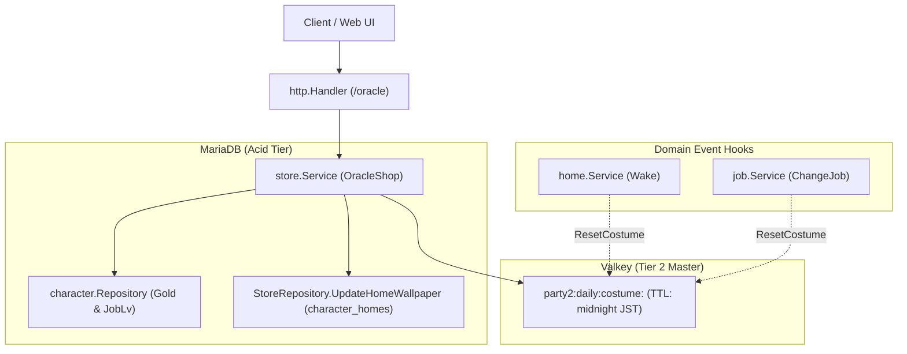

# Oracle Shop & Costume Rental Design Specification

## Overview

The Oracle Shop (`oracle`) subsystem reconstructs and modernizes the original Party2 `party2/lib/goods.cgi` ("オラクル屋 `@ラクル`") facility.
Located in town, the enigmatic oracle `@ラクル` provides daily costume icon rentals that alter character appearance, private estate scenic wallpapers (`character_homes.bgimg`), fortune-telling dialogue, and hints pointing experienced adventurers toward the clandestine Black Market (`job_lv >= 15`).

---

## 1. Legacy Reconciliation Table

| Legacy Routine / Action | Modern Go Domain Method | Modern HTTP Endpoint | Reconciliation Status & Rationale |
|---|---|---|---|
| `&goods` (Catalog) | `store.Service.GetOracleStatus` | `GET /characters/{id}/oracle` | **Reconciled (1:1)**: Dynamically gates costume catalog based on character `job_lv`. Returns current active rental and available wallpapers. |
| `@words` (Dialogue) | `store.Service.OracleTalk` | `POST /characters/{id}/oracle/talk` | **Reconciled (1:1)**: Delivers 1 of 5 randomized fortune/oracle lines (`OracleWords`). |
| `&chousa` (Inspect) | `store.Service.OracleInspect` | `POST /characters/{id}/oracle/inspect` | **Reconciled (1:1)**: Returns NPC description, plus conditional clue for Black Market when `job_lv >= 15`. |
| `&rental` (Costume Rent) | `store.Service.RentCostume` | `POST /characters/{id}/oracle/rent` | **Reconciled (1:1)**: Rents costume icon for gold. Overwrites existing rental; expires at midnight JST, sleep rest, or job change. |
| `&return` (Costume Return) | `store.Service.ReturnCostume` | `POST /characters/{id}/oracle/return` | **Reconciled (1:1)**: Manually returns active rented costume. |
| `&kabe` (Wallpaper Buy) | `store.Service.BuyHomeWallpaper` | `POST /characters/{id}/oracle/wallpaper` | **Reconciled (1:1)**: Purchases scenic home wallpaper from legacy `%kabes` catalog and updates `character_homes.bgimg`. |
| `＠やみいちば` (Unlock Check) | `store.Service.DiscoverBlackMarket` | `POST /characters/{id}/oracle/blackmarket` | **Reconciled (1:1)**: Validates eligibility (`job_lv >= 15`) to access the Black Market from Oracle hints. |

---

## 2. Domain Rules & Mathematical Formulas

### 2.1 Costume Catalog Gating Formula

Legacy `goods.cgi` determines available rental items using the character's Job Level:

```perl
# Legacy goods.cgi line 18-24
if ($job_lv > 10) {
    @sales = (44..56);
} else {
    @sales = (44 .. 45 + $job_lv);
}
if ($job_lv > 15) {
    push(@sales, (138..141));
}
```

- **Level 0**: Items 44..45 (Base Novice costumes).
- **Level 1..10**: Items 44 .. (45 + `job_lv`).
- **Level > 10**: Items 44..56.
- **Level > 15**: Items 44..56 plus additional rare items 138..141.

Rental prices are standardized at 500 G per costume.

### 2.2 Gender-Differentiated Costume Icons

Items 46, 55, 56, and 140 provide gender-specific icons based on character gender (`1` = Male, `2` = Female):

| Item No | Item Name | Male Icon (`gender == 1`) | Female Icon (`gender == 2`) |
|---|---|---|---|
| 46 | メイド服 / 執事服 | `m46.gif` (Butler) | `f46.gif` (Maid) |
| 55 | 水着 | `m55.gif` (Trunks) | `f55.gif` (Swimsuit) |
| 56 | 浴衣 | `m56.gif` (Yukata M) | `f56.gif` (Yukata F) |
| 140 | パジャマ | `m140.gif` (Pajamas M) | `f140.gif` (Pajamas F) |

All other costumes use ungendered icons (`44.gif`–`54.gif`, `138.gif`, `139.gif`, `141.gif`).

### 2.3 Rental Expiration & Lifecycle Hooks

Costume rentals are ephemeral state governed by three distinct expiration conditions:
1. **Midnight JST Expiration**: Stored in Valkey under `party2:daily:costume:<character_id>` with TTL set to next midnight JST.
2. **Daily Rest (`Wake`) Hook**: When a character rests in their estate (`home.Wake`), `CostumeResetter.ResetCostume` is invoked to clear the rental.
3. **Job Change Hook**: When changing profession (`job.ChangeJob`), `CostumeResetter.ResetCostume` is invoked to reset the rented icon.
4. **Manual Return**: Characters may manually return their costume via `POST /characters/{id}/oracle/return`.

### 2.4 Private Estate Wallpaper Boutique

Adventurers can purchase decorative scenic backgrounds for their personal home estate:
- Wallpapers are drawn from the comprehensive legacy `%kabes` catalog (26 variants, pricing between 0 G and 10,500 G).
- Successful purchase persists `bgimg` to the `character_homes` relational table (`ON DUPLICATE KEY UPDATE bgimg = VALUES(bgimg)`).

### 2.5 NPC Inspection & Black Market Hint

- Inspecting `@ラクル` yields: `「オラクル屋のラクルよ。今日の運勢はどうかしら？」`
- If the character has attained Job Level 15 or higher (`job_lv >= 15`), an additional hint is revealed:
  `「…ふふ、腕の立つ冒険者には、特別な取引所を紹介してあげるわ。“＠やみいちば”を探してみなさい」`

---

## 3. Storage & Transaction Architecture



- **Valkey Key**: `party2:daily:costume:<character_id>`
- **TTL**: Seconds until next midnight JST (`time.Until(NextMidnightJST())`).
- **Relational Updates**: Gold deduction and wallpaper updates use the transactional lock hierarchy (`characters` locked for update before gold deduction).
