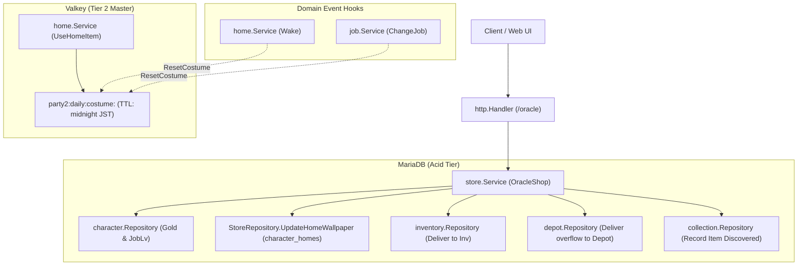

# Oracle Shop & Costume Parity Design Specification

## Overview

The Oracle Shop (`oracle`) subsystem reconstructs and modernizes the original Party2 `party2/lib/goods.cgi` ("オラクル屋 `@ラクル`") facility.
Located in town, the enigmatic oracle `@ラクル` sells costume consumable items (items 44..56 and 138..141), private estate scenic wallpapers (`character_homes.bgimg`), delivers fortune-telling dialogue, and drops hints pointing experienced adventurers toward the clandestine Black Market (`job_lv >= 15`).

---

## 1. Legacy Reconciliation Table

| Legacy Routine / Action | Modern Go Domain Method | Modern HTTP Endpoint | Reconciliation Status & Rationale |
|---|---|---|---|
| `&goods` (Catalog) | `store.Service.GetOracleStatus` | `GET /characters/{id}/oracle` | **Reconciled (1:1)**: Dynamically gates costume catalog based on character `job_lv` and excludes active helper quest 3 items. Returns current active costume and available wallpapers. |
| `@words` (Dialogue) | `store.Service.OracleTalk` | `POST /characters/{id}/oracle/talk` | **Reconciled (1:1)**: Delivers 1 of 5 randomized fortune/oracle lines (`OracleWords`). |
| `&shiraberu_npc` (Inspect) | `store.Service.OracleInspect` | `POST /characters/{id}/oracle/inspect` | **Reconciled (1:1)**: Returns NPC description, plus conditional clue for Black Market when `job_lv >= 15`. |
| `&kau` (Item Buy) | `store.Service.BuyCostumeItem` | `POST /characters/{id}/oracle/buy` | **Reconciled (1:1)**: Purchases authentic costume consumable items (44..56, 138..141) into inventory (or depot overflow), records in collection, and excludes items requested in helper quest 3. |
| `&kabegami` (Wallpaper Buy) | `store.Service.BuyHomeWallpaper` | `POST /characters/{id}/oracle/wallpaper` | **Reconciled (1:1)**: Purchases scenic home wallpaper from legacy `%kabes` catalog and updates `character_homes.bgimg`. |
| `＠やみいちば` (Unlock Check) | `store.Service.DiscoverBlackMarket` | `POST /characters/{id}/oracle/blackmarket` | **Reconciled (1:1)**: Validates eligibility (`job_lv >= 15`) to access the Black Market from Oracle hints. |

---

## 2. Domain Rules & Mathematical Formulas

### 2.1 Costume Catalog Gating Formula

Legacy `goods.cgi` determines available costume purchase items using the character's Job Level:

```perl
# Legacy goods.cgi line 17-18
@sales = $m{job_lv} > 10 ? ( 44 .. 56 ) : ( 44 .. 45 + $m{job_lv} );
push @sales, ( 138 .. 141 ) if $m{job_lv} > 15;
```

- **Level 0**: Items 44..45 (Base Novice costumes).
- **Level 1..10**: Items 44 .. (45 + `job_lv`).
- **Level > 10**: Items 44..56.
- **Level > 15**: Items 44..56 plus additional rare items 138..141.

Items requested by active helper quest 3 (`get_helper_item(3)`) are excluded from sale:
```perl
next if $h_no =~ /,$i,/; # 手助けクエストで依頼されているアイテムは除く
```

### 2.2 Authentic Costume Catalog & Gender Parity

Items 44..56 and 138..141 are consumable items (type 2) with legacy catalog pricing and appearance icons:

| Item No | Item Name | Price (G) | Male Icon | Female Icon | Usage Dialogue |
|---|---|---|---|---|---|
| 44 | ピンクスカート | 300 | `chr/001.gif` | `chr/001.gif` | `<name>はピンクスカートのコスプレをした！` |
| 45 | タンクトップハンマー | 300 | `chr/005.gif` | `chr/005.gif` | `<name>はタンクトップハンマーのコスプレをした！` |
| 46 | チョビヒゲタクシード | 300 | `chr/012.gif` | `chr/007.gif` | `<name>はチョビヒゲタクシードのコスプレをした！` |
| 47 | ネコミミメイド | 300 | `chr/004.gif` | `chr/004.gif` | `<name>はネコミミメイドのコスプレをした！` |
| 48 | ホビット | 300 | `chr/014.gif` | `chr/014.gif` | `<name>はホビットのコスプレをした！` |
| 49 | ハナメガネ | 300 | `chr/021.gif` | `chr/021.gif` | `<name>はハナメガネのコスプレをした！` |
| 50 | ぬいぐるみ | 300 | `chr/023.gif` | `chr/023.gif` | `<name>はぬいぐるみのコスプレをした！` |
| 51 | 冒険家の衣装 | 300 | `chr/003.gif` | `chr/003.gif` | `<name>は冒険家のコスプレをした！` |
| 52 | 騎士団の衣装 | 300 | `chr/015.gif` | `chr/015.gif` | `<name>は騎士団のコスプレをした！` |
| 53 | 老人の衣装 | 300 | `chr/013.gif` | `chr/013.gif` | `<name>は老人のコスプレをした！` |
| 54 | 精霊の衣装 | 300 | `chr/011.gif` | `chr/011.gif` | `<name>は精霊のコスプレをした！` |
| 55 | 聖職者の衣装 | 400 | `chr/016.gif` | `chr/017.gif` | `<name>は聖職者のコスプレをした！` |
| 56 | 王族の衣装 | 500 | `chr/002.gif` | `chr/018.gif` | `<name>は王様のコスプレをした！` |
| 138 | タクシード | 500 | `chr/027.gif` | `chr/027.gif` | `<name>はタクシードのコスプレをした！` |
| 139 | 闇人の衣装 | 600 | `chr/025.gif` | `chr/025.gif` | `<name>は闇人のコスプレをした！` |
| 140 | 英雄の衣装 | 700 | `chr/034.gif` | `chr/028.gif` | `<name>は英雄のコスプレをした！` |
| 141 | 変身の巻物 | 1500 | `chr/<001..040>.gif` | `chr/<001..040>.gif` | `<name>は変身の巻物を読んだ！` |

### 2.3 Costume Item Consumption & Active Appearance Lifecycle

When a character consumes a costume item in `internal/home` (`UseHomeItem`):
1. **Application**: The character's appearance icon changes to the costume graphic with gender parity.
2. **Ephemeral State**: Stored under `party2:daily:costume:<character_id>` in Valkey with expiration set to next midnight JST (`timer.NextMidnightJST(now)`).
3. **Reset Triggers**:
   - **Daily Rest (`home.Wake`)**: Sleeping in home resets the costume icon back to standard job icon (`job/<job>_<sex>.gif`).
   - **Job Change (`job.ChangeJob`)**: Changing professions clears the costume icon back to new job default (`job/<job>_<sex>.gif`).
   - **Midnight JST Expiration**: Natural TTL expiration at 00:00 JST.

### 2.4 Private Estate Wallpaper Boutique

Adventurers can purchase decorative scenic backgrounds for their personal home estate:
- Wallpapers are drawn from the comprehensive legacy `%kabes` catalog (26 variants, pricing between 0 G and 10,500 G).
- Successful purchase persists `bgimg` to the `character_homes` relational table (`ON DUPLICATE KEY UPDATE bgimg = VALUES(bgimg)`).

### 2.5 NPC Inspection & Black Market Hint

- Inspecting `@ラクル` yields: `@ラクル「おっ？なんじゃなんじゃ？わしゃ何も知らんよ」`
- If the character has attained Job Level 15 or higher (`job_lv >= 15`), an additional hint is revealed:
  `＠やみいちば に行きたい`

---

## 3. Storage & Transaction Architecture



- **Valkey Key**: `party2:daily:costume:<character_id>`
- **TTL**: Seconds until next midnight JST (`time.Until(NextMidnightJST())`).
- **Relational Updates**: Gold deduction and inventory/depot delivery strictly follow the lock hierarchy (Rank 0 Character -> Rank 3 Inventory -> Rank 5 Depot).
