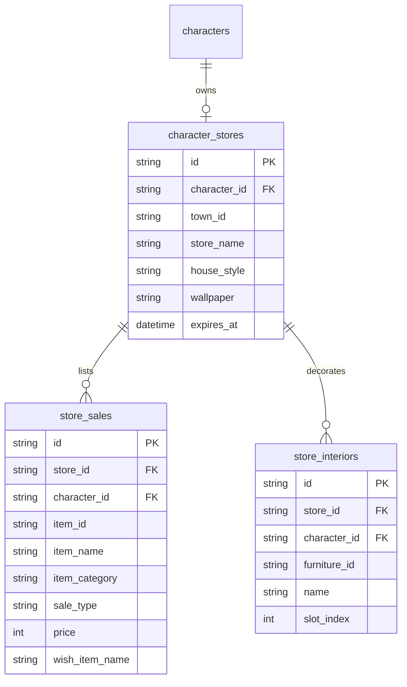

# Player Store and Boutique Design Specification

## Overview

The Player Store (`store`) subsystem reconstructs and modernizes the original Party2 `store.cgi` ("プレイヤーストア / バザール") mechanics.
Player Stores represent permanent commercial real-estate built within the 4 towns (`town1`–`town4`). Adventurers invest substantial capital (50,000 G) to establish their own boutique, listing items from their warehouse (`depot`) for either direct gold purchase or item-for-item barter trade. Store owners can customize their storefront with customized signboard names, decorative wallpapers (26 legacy styles), and indoor furniture pieces (15 legacy furniture models) with custom labels.

---

## 1. Legacy `@actions` Reconciliation Table

| Legacy Action | Legacy Subroutine | Modern Go Domain Method | Modern HTTP Endpoint | Reconciliation Status & Rationale |
|---|---|---|---|---|
| `建てる` / `みせ` | `&tateru` | `StoreService.BuildStore` | `POST /towns/{town_id}/stores` | **Reconciled (1:1)**: Constructs a store in towns 1–4 for 50,000 G with 90-day maintenance cycle. Awards 900 GP if in a guild. Max 10 stores per town, 1 store per character. |
| `みる` | `&miru` | `StoreService.GetStore` `StoreService.GetTownStores` | `GET /stores/{store_id}` `GET /towns/{town_id}/stores` | **Reconciled (1:1)**: Lists town stores or displays interior, wallpaper, signboard, and active sales catalog. |
| `かくにん` | `&kakunin` | `StoreService.CheckStore` | `GET /characters/{id}/store` | **Reconciled (1:1)**: Inspects personal store status, remaining cycle duration, and active inventory. |
| `売る` (ゴールド) | `&uru_gold` | `StoreService.ListGoldItem` | `POST /characters/{id}/store/listings/gold` | **Reconciled (1:1)**: Lists depot item for direct gold sale (1–9,999,999 G). Capacity: 10 + `OverStore` * 2 (10–20 items). |
| `売る` (物々交換) | `&uru_barter` | `StoreService.ListBarterItem` | `POST /characters/{id}/store/listings/barter` | **Reconciled (1:1)**: Lists depot item specifying exact desired barter item name. |
| `とりけし` | `&torikesi` | `StoreService.WithdrawListing` | `DELETE /characters/{id}/store/listings/{sale_id}` | **Reconciled (1:1)**: Cancels store listing and returns the item safely to owner's depot. |
| `かう` (ゴールド) | `&kau_gold` | `StoreService.BuyItem` | `POST /characters/{id}/store/sales/{sale_id}/buy` | **Reconciled (1:1)**: Buyer pays listed gold. Gold deposited into seller wallet, item moved into buyer depot. |
| `かう` (物々交換) | `&kau_barter` | `StoreService.TradeItem` | `POST /characters/{id}/store/sales/{sale_id}/trade` | **Reconciled (1:1)**: Buyer exchanges matching depot item for listed item. Both items transferred atomically. |
| `かんばん` | `&kanban` | `StoreService.ChangeStoreName` | `POST /characters/{id}/store/name` | **Reconciled (1:1)**: Modifies store signboard name for 5,000 G. Max 8 characters, validated and sanitized. |
| `かべがみ` | `&kabegami` | `StoreService.ChangeWallpaper` | `POST /characters/{id}/store/wallpaper` | **Reconciled (1:1)**: Updates boutique wallpaper from 26 historical styles (`%kabes`) with tier pricing (0–10,500 G). |
| `おく` (インテリア) | `&oku` | `StoreService.AddInterior` | `POST /characters/{id}/store/interiors` | **Reconciled (1:1)**: Places furniture from 15 available styles (`001`–`023`) for 1,000 G each (max 5 interiors). |
| `なづける` | `&nazukeru` | `StoreService.RenameInterior` | `PUT /characters/{id}/store/interiors/{interior_id}/name` | **Reconciled (1:1)**: Renames placed furniture piece (max 8 characters). |
| `そうじ` | `&souji` | `StoreService.CleanInteriors` | `DELETE /characters/{id}/store/interiors` | **Reconciled (1:1)**: Clears all placed furniture from the store. |

---

## 2. Domain Architecture & Invariants

### Invariants:
1. **Town Allocation & Quotas**:
   - Stores can only be built in towns `town1`, `town2`, `town3`, `town4`.
   - Maximum of 10 stores allowed per town (`MaxTownStores = 10`).
   - One character can own at most one store (`ErrStoreAlreadyExists`).
2. **Maintenance Cycle & Timers**:
   - Initial construction duration is 90 days (`StoreCycleDays = 90`).
   - Store timer registered under timer category `store` in `timers` table.
   - When 90 days expire without renewal, store is marked expired (`ErrStoreExpired`).
3. **Listing Capacities & Mechanics**:
   - Base listing capacity is 10 items.
   - Characters with `OverStore` attribute expand capacity: `10 + OverStore * 2` (up to 20 maximum).
   - Only unequipped, stored items from `depot` can be placed into the store.
4. **Pessimistic Locking & Deadlock-Free Ordering**:
   - Cross-character and cross-inventory transactions strictly adhere to the system Lock Hierarchy (`internal/database/lock_hierarchy_lint_test.go`):
     - **Rank 0**: `store_sales` (`GetSaleByIDForUpdate`) - Shared peer entity.
     - **Rank 2**: `characters` (`FindByIDForUpdate`) - Locked in ascending lexical ID order: `min(id1, id2)` -> `max(id1, id2)`.
     - **Rank 5**: `depots` (`FindByCharacterIDForUpdate`) - Locked in ascending character ID order: `min(id1, id2)` -> `max(id1, id2)`.
5. **Interior & Customization Limits**:
   - Max 5 furniture pieces per store (`MaxInteriorCount = 5`).
   - Furniture costs 1,000 G per piece; wallpaper costs range from 0 G to 10,500 G.
   - Store and interior names cannot exceed 8 characters and are validated against reserved delimiters.
